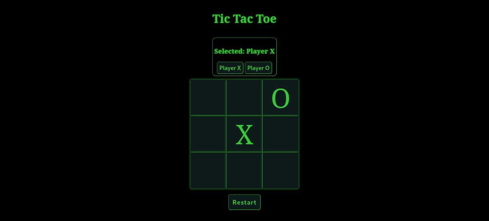

# Tic-Tac-Toe-TOP-project

A simple Tic Tac Toe game you can play in your browser.



## Features

- Classic Tic Tac Toe gameplay
- Interactive web-based interface
- Playable directly in your browser

## Getting Started

### Play Online

Visit the [GitHub Pages site](https://feoled.github.io/Tic-Tac-Toe-TOP-project/) (if enabled) or clone the repo and open `index.html` in your browser.

### Clone & Run Locally

```bash
git clone https://github.com/FeoLED/Tic-Tac-Toe-TOP-project.git
cd Tic-Tac-Toe-TOP-project
# Open index.html in your browser
```

## Technologies Used

- JavaScript
- HTML
- CSS

## License

This project is licensed under the [MIT License](LICENSE).

---

Made by [FeoLED](https://github.com/FeoLED)